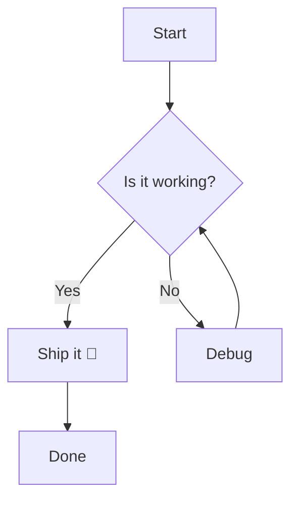
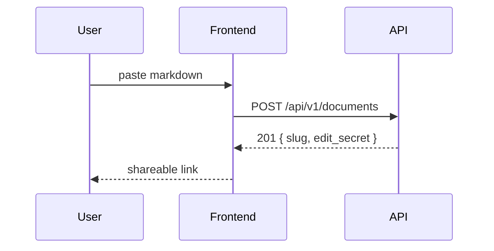
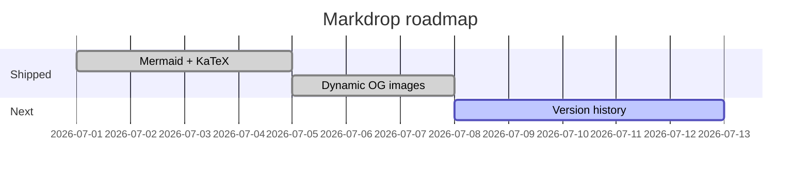
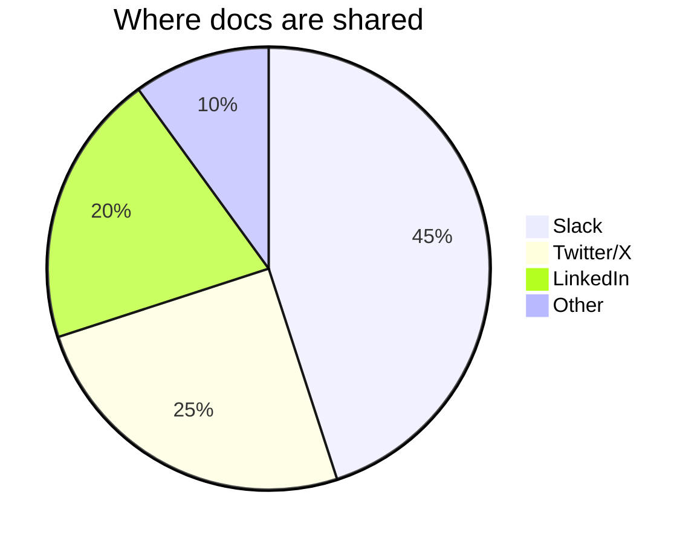

# Markdrop render test — Mermaid + KaTeX

A doc to exercise the new client-side rendering: Mermaid diagrams, LaTeX math,
and plain highlighted code (which should still work as before).

## 1. Inline & block math (KaTeX)

Inline: the mass–energy relation is $E = mc^2$, and the sum $\sum_{k=1}^{n} k = \frac{n(n+1)}{2}$.

Block:

$$
\int_{0}^{1} x^2 \, dx = \left[ \frac{x^3}{3} \right]_0^1 = \frac{1}{3}
$$

$$
f(x) = \frac{1}{\sigma\sqrt{2\pi}} \, e^{-\frac{1}{2}\left(\frac{x-\mu}{\sigma}\right)^2}
$$

## 2. Flowchart



## 3. Sequence diagram



## 4. Gantt chart



## 5. Pie chart



## 6. Normal code block (should stay syntax-highlighted, with a Copy button)

```python
def fib(n: int) -> int:
    a, b = 0, 1
    for _ in range(n):
        a, b = b, a + b
    return a
```

```typescript
const greet = (name: string): string => `Hello, ${name}!`;
console.log(greet("Markdrop"));
```

## 7. Broken Mermaid (should fall back to raw source, not crash)

```mermaid
graph TD; A -->
```

Inline `code`, **bold**, and a [link](https://markdrop.in) round it out.
